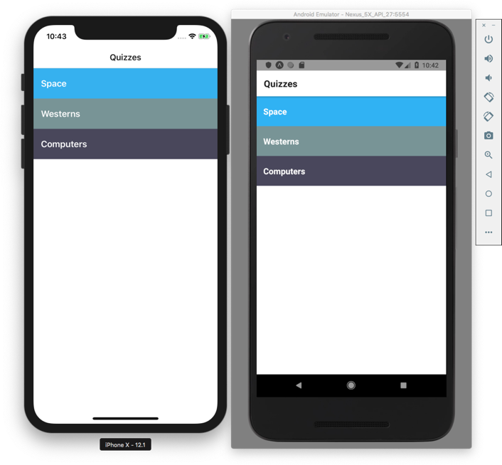
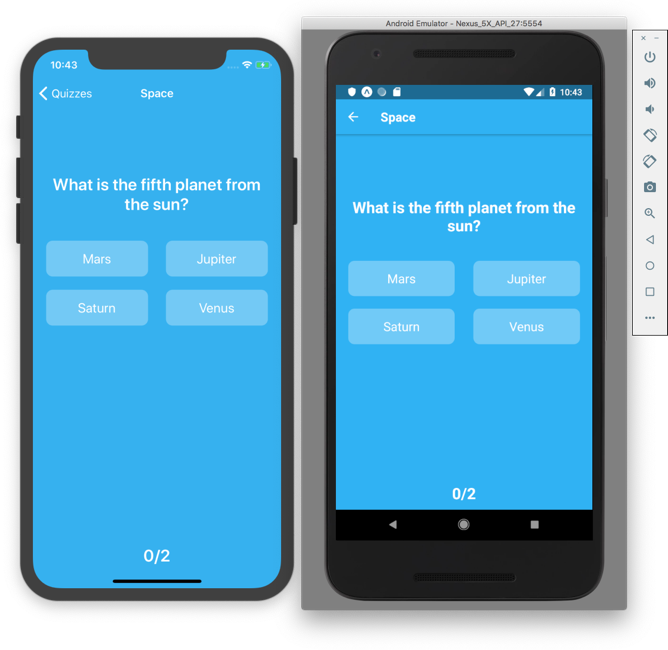

# React Native Code Push Playground
A Demo Application for code push

## IMPORTANT NOTE
I am applying Tutorial by Spencer Carli in this class
https://learn.reactnativeschool.com/p/over-the-air-updates-with-codepush

## Screenshots

## Prerequisites

- React Native CLI to be installed. You can install it by running the command:

`npm install -g react-native-cli`

- Simulator or emulator to run the app on.

### Installation

First clone the repo using `SSH` or `HTTPS`.
Here's an example using `HTTPS`:

`git clone https://github.com/mongy92/react-native-code-push-playground.git`

Second run the following command to install project dependencies:

`yarn install` 

**in IOS**

You will need to make one more step to install pods dependencies, run the following command in the project directory:

- `cd ios && pod install`

### Run on Device

- run `yarn android` or `yarn ios` to run on device or emulator.

